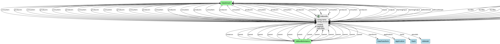
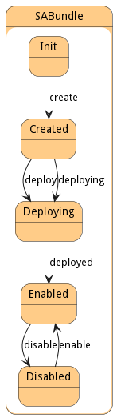

# SABundle

Sentient Agent Bundle consists of the definition of the services, data streams, and configurations to transform data at the edge and publish the results to upstream SABRs

## Attributes

* name:string - Name of the Sentient Agent Bundle
* version:string - Version of the SABundle

## Associations

| Name | Cardinality | Class | Composition | Owner | Description |
| --- | --- | --- | --- | --- | --- |
| inputs | n | DataStream | false | false | Input Data Streams for the SABR |
| outputs | n | DataStream | false | false | Output Data Streams for the SABR |
| learningStream | 1 | DataStream |  |  | Learning Corpus Stream receives updates and sends out updates to the aimodel |
| adminStream | 1 | DataStream |  |  | Administration Stream to handle registration of SABRS to Capabilities |
| transforms | n | DataTransform |  |  | Data Transformations run on input data send to output data. |
| applications | n | Application |  |  |  |
| stacks | n | Stack | false | false |  |
| aimodels | n | AIModel | false | false |  |
| instances | n | SABundleInstance | false | true |  |
| secureVault | 1 | SecureVault | true | true |  |

## Users of the Model

| Name | Cardinality | Class | Composition | Owner | Description |
| --- | --- | --- | --- | --- | --- |
| bundles | n | Capability | false | false | SABR Bundles that make up the Capabilities. |
| consumers | n | DataStream |  |  | This is a consumer of the data stream. |
| producers | n | DataStream |  |  | This is a producer of the data stream. |
| parent | 1 | SABundleInstance |  |  | Parent of the SAB Instance |

## State Net
The SABundle has a state net corresponding to instances of the class. Each state transistion will emit an 
event that can be caught with a websocket client. The name of the event is the name of the state in all lower case.
The following diagram is the state net for this class.

| Name | Description | Events |
| --- | --- | --- |
| Init | Initial State | create-&gt;Created,  |
| Created | The SAB has been created and ready and can be built. | build-&gt;Building,  |
| Building | The SAB is being built. | built-&gt;Built, failed-&gt;Failed,  |
| Built | The SABR has been built and ready to be deployed. | deploy-&gt;Deploying, deploying-&gt;Deploying,  |
| Deploying | The SABR is connecting to all of the streams including admin and learning streams. | deployed-&gt;Enabled,  |
| Enabled | The SABR is running all transformation and streams are receiving and transmitting | disable-&gt;Disabled,  |
| Disabled | The SABR is disabled and is not receiving or transmitting data. | enable-&gt;Enabled,  |
| Failed | The SABR failed to be built or created. |  |

## Methods

* [build() - Build the Sentient Agent Bundle](#action-build)

* [create() - Create a Sentient Agent Bundle](#action-create)

* [deploy() - Deploy a SABundle](#action-deploy)

* [toJScript() - Convert the Bundle to a string to be passed over a connection.](#action-toJScript)

<h2>Method Details</h2>
    
### Action sabundle build

* REST - sabundle/build?buildID=string
* bin - sabundle build --buildID string
* js - sabundle.build({ buildID:string })

#### Description
Build the Sentient Agent Bundle

#### Parameters

| Name | Type | Required | Description |
|---|---|---|---|
| buildID | string |true | ID for the build of the bundle |

### Action sabundle create

* REST - sabundle/create?name=string&amp;file=file
* bin - sabundle create --name string --file file
* js - sabundle.create({ name:string,file:file })

#### Description
Create a Sentient Agent Bundle

#### Parameters

| Name | Type | Required | Description |
|---|---|---|---|
| name | string |true | name of the Sentient Agent Bundle |
| file | file |false | file with the definition |

### Action sabundle deploy

* REST - sabundle/deploy?policies=ref
* bin - sabundle deploy --policies ref
* js - sabundle.deploy({ policies:ref })

#### Description
Deploy a SABundle

#### Parameters

| Name | Type | Required | Description |
|---|---|---|---|
| policies | ref |true | Policies to use for deploying the Bundle. |

### Action sabundle toJScript

* REST - sabundle/toJScript?
* bin - sabundle toJScript 
* js - sabundle.toJScript({  })

#### Description
Convert the Bundle to a string to be passed over a connection.

#### Parameters

No parameters

