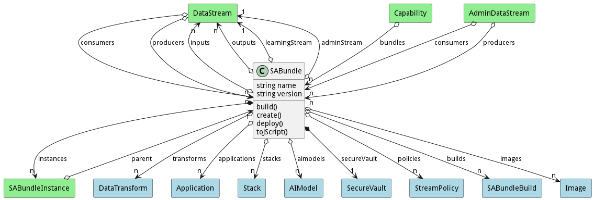
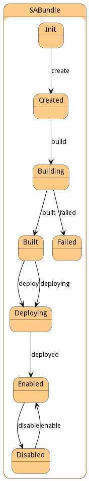

# SABundle

Sentient Agent Bundle consists of the definition of the services, data streams, and configurations to transform data at the edge and publish the results to upstream SABRs

## Attributes

* name:string - Name of the Sentient Agent Bundle
* version:string - Version of the SABundle

## Associations

| Name | Cardinality | Class | Composition | Owner | Description |
| --- | --- | --- | --- | --- | --- |
| inputs | n | DataStream | false | false | Input Data Streams for the SABR |
| outputs | n | DataStream | false | false | Output Data Streams for the SABR |
| learningInput | 1 | DataStream |  |  | Learning Corpus Input Stream receives updates to the aimodel |
| learningOutput | 1 | DataStream |  |  | Learning Corpus Output Stream receives updates to the aimodel |
| adminStream | 1 | DataStream |  |  | Administration Stream to handle registration of SABRS to Capabilities |
| admoutStream | 1 | DataStream |  |  | Administration Stream to handle registration of SABRS and Capabilities |
| transforms | n | DataTransform |  |  | Data Transformations run on input data send to output data. |
| applications | n | Application |  |  |  |
| stacks | n | Stack | false | false |  |
| aimodels | n | AIModel | false | false |  |
| instances | n | SABundleInstance | false | true |  |

## Users of the Model

| Name | Cardinality | Class | Composition | Owner | Description |
| --- | --- | --- | --- | --- | --- |
| bundles | n | Capability | false | false |  |
| consumers | n | DataStream |  |  | This is a consumer of the data stream. |
| producers | n | DataStream |  |  | This is a producer of the data stream. |
| parent | 1 | SABundleInstance |  |  |  |
| bundles | n | Capability | false | false |  |
| consumers | n | DataStream |  |  | This is a consumer of the data stream. |
| producers | n | DataStream |  |  | This is a producer of the data stream. |
| parent | 1 | SABundleInstance |  |  |  |
| bundles | n | Capability | false | false |  |
| consumers | n | DataStream |  |  | This is a consumer of the data stream. |
| producers | n | DataStream |  |  | This is a producer of the data stream. |
| parent | 1 | SABundleInstance |  |  |  |
| bundles | n | Capability | false | false |  |
| consumers | n | DataStream |  |  | This is a consumer of the data stream. |
| producers | n | DataStream |  |  | This is a producer of the data stream. |
| parent | 1 | SABundleInstance |  |  |  |
| bundles | n | Capability | false | false |  |
| consumers | n | DataStream |  |  | This is a consumer of the data stream. |
| producers | n | DataStream |  |  | This is a producer of the data stream. |
| parent | 1 | SABundleInstance |  |  |  |
| bundles | n | Capability | false | false |  |
| consumers | n | DataStream |  |  | This is a consumer of the data stream. |
| producers | n | DataStream |  |  | This is a producer of the data stream. |
| parent | 1 | SABundleInstance |  |  |  |
| bundles | n | Capability | false | false |  |
| consumers | n | DataStream |  |  | This is a consumer of the data stream. |
| producers | n | DataStream |  |  | This is a producer of the data stream. |
| parent | 1 | SABundleInstance |  |  |  |
| bundles | n | Capability | false | false |  |
| consumers | n | DataStream |  |  | This is a consumer of the data stream. |
| producers | n | DataStream |  |  | This is a producer of the data stream. |
| parent | 1 | SABundleInstance |  |  |  |
| bundles | n | Capability | false | false |  |
| consumers | n | DataStream |  |  | This is a consumer of the data stream. |
| producers | n | DataStream |  |  | This is a producer of the data stream. |
| parent | 1 | SABundleInstance |  |  |  |
| bundles | n | Capability | false | false |  |
| consumers | n | DataStream |  |  | This is a consumer of the data stream. |
| producers | n | DataStream |  |  | This is a producer of the data stream. |
| parent | 1 | SABundleInstance |  |  |  |
| bundles | n | Capability | false | false |  |
| consumers | n | DataStream |  |  | This is a consumer of the data stream. |
| producers | n | DataStream |  |  | This is a producer of the data stream. |
| parent | 1 | SABundleInstance |  |  |  |
| bundles | n | Capability | false | false |  |
| consumers | n | DataStream |  |  | This is a consumer of the data stream. |
| producers | n | DataStream |  |  | This is a producer of the data stream. |
| parent | 1 | SABundleInstance |  |  |  |
| bundles | n | Capability | false | false |  |
| consumers | n | DataStream |  |  | This is a consumer of the data stream. |
| producers | n | DataStream |  |  | This is a producer of the data stream. |
| parent | 1 | SABundleInstance |  |  |  |
| bundles | n | Capability | false | false |  |
| consumers | n | DataStream |  |  | This is a consumer of the data stream. |
| producers | n | DataStream |  |  | This is a producer of the data stream. |
| parent | 1 | SABundleInstance |  |  |  |
| bundles | n | Capability | false | false |  |
| consumers | n | DataStream |  |  | This is a consumer of the data stream. |
| producers | n | DataStream |  |  | This is a producer of the data stream. |
| parent | 1 | SABundleInstance |  |  |  |

## State Net

| Name | Description | Events |
| --- | --- | --- |
| Init | Initial State | create-&gt;Created,  |
| Created | The SABR has been created and ready to be deployed. | deploy-&gt;Deploying, deploying-&gt;Deploying,  |
| Deploying | The SABR is connecting to all of the streams including admin and learning streams. | deployed-&gt;Enabled,  |
| Enabled | The SABR is running all transformation and streams are receiving and transmitting | disable-&gt;Disabled,  |
| Disabled | The SABR is disabled and is not receiving or transmitting data. | enable-&gt;Enabled,  |

## Methods

* [create() - Create a Sentient Agent Bundle](#action-create)

* [deploy() - Deploy a SABundle](#action-deploy)

* [toJScript() - Convert the Bundle to a string to be passed over a connection.](#action-toJScript)

<h2>Method Details</h2>
    
### Action sabundle create

* REST - sabundle/create
* bin - sabundle create
* js - sabundle.create

Create a Sentient Agent Bundle

| Name | Type | Required | Description |
|---|---|---|---|
| name | string |true | name of the Sentient Agent Bundle |
| file | file |false | file with the definition |

### Action sabundle deploy

* REST - sabundle/deploy
* bin - sabundle deploy
* js - sabundle.deploy

Deploy a SABundle

| Name | Type | Required | Description |
|---|---|---|---|
| policies | ref |true | Policies to use for deploying the Bundle. |

### Action sabundle toJScript

* REST - sabundle/toJScript
* bin - sabundle toJScript
* js - sabundle.toJScript

Convert the Bundle to a string to be passed over a connection.

| Name | Type | Required | Description |
|---|---|---|---|

