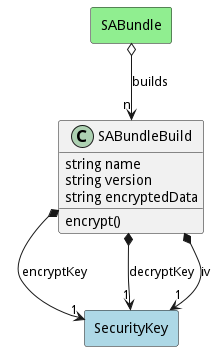

# SABundleBuild

This is a build of a SABundle.

## Attributes

* name:string - Name of the SABundle Build
* version:string - Version of the SABundle Build
* encryptedData:string - Encrypted Data for the Bundle.

## Associations

| Name | Cardinality | Class | Composition | Owner | Description |
| --- | --- | --- | --- | --- | --- |
| encryptKey | 1 | SecurityKey | true | true |  |
| decryptKey | 1 | SecurityKey | true | true |  |
| iv | 1 | SecurityKey | true | true | Init Vector of the cipher |

## Users of the Model

| Name | Cardinality | Class | Composition | Owner | Description |
| --- | --- | --- | --- | --- | --- |
| builds | n | SABundle |  |  | Builds for the SABundle. A SABundleBuild encrypts the bundle and gets it ready for deployment. |

## Methods
* [encrypt() - Encrypt the BABundle](#action-encrypt)

<h2>Method Details</h2>
    
### Action sabundlebuild encrypt

* REST - sabundlebuild/encrypt?bundle=ref
* bin - sabundlebuild encrypt --bundle ref
* js - sabundlebuild.encrypt({ bundle:ref })

#### Description
Encrypt the BABundle

#### Parameters

| Name | Type | Required | Description |
|---|---|---|---|
| bundle | ref |true | Bundle to be encrypted |

