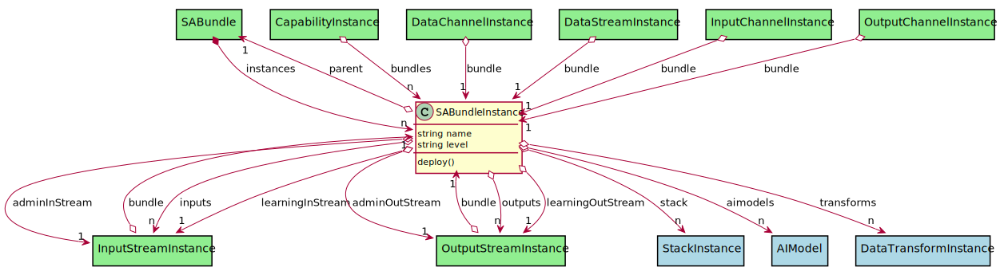
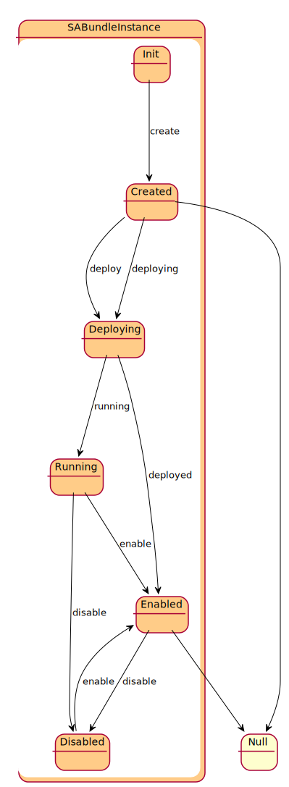

# SABundleInstance

Instance of a sentient agent bundle. This is were things are running. This includes the instances of services, channels, transformation services, etc...

## Attributes

* name:string - Name of the sentient agent bundle instance
* level:string - Level of the SABR Instance. Determines the mode of operation.

## Associations

| Name | Cardinality | Class | Composition | Owner | Description |
| --- | --- | --- | --- | --- | --- |
| parent | 1 | SABundle |  |  |  |
| inputs | n | InputStreamInstance | false | false | Input Data Streams for the SABR |
| outputs | n | OutputStreamInstance | false | false | Output Data Streams for the SABR |
| learningInput | 1 | InputStreamInstance |  |  | Learning Corpus Input Stream receives updates to the aimodel |
| learningOutput | 1 | OutputStreamInstance |  |  | Learning Corpus Output Stream receives updates to the aimodel |
| adminStream | 1 | InputStreamInstance |  |  | Administration Stream to handle registration of SABRS to Capabilities |
| admoutStream | 1 | OutputStreamInstance |  |  | Administration Stream to handle registration of SABRS and Capabilities |
| stack | n | StackInstance | false | false |  |
| aimodels | n | AIModel | false | false |  |
| transforms | n | DataTransformInstance | false | false |  |

## Users of the Model

| Name | Cardinality | Class | Composition | Owner | Description |
| --- | --- | --- | --- | --- | --- |
| bundles | n | CapabilityInstance |  |  | Bundle instances running on the ecosystem. |
| bundle | 1 | DataChannelInstance |  |  | This is the sabr instance |
| bundle | 1 | DataStreamInstance |  |  |  |
| instances | n | SABundle | false | true |  |
| bundles | n | CapabilityInstance |  |  | Bundle instances running on the ecosystem. |
| bundle | 1 | DataChannelInstance |  |  | This is the sabr instance |
| bundle | 1 | DataStreamInstance |  |  |  |
| instances | n | SABundle | false | true |  |
| bundles | n | CapabilityInstance |  |  | Bundle instances running on the ecosystem. |
| bundle | 1 | DataChannelInstance |  |  | This is the sabr instance |
| bundle | 1 | DataStreamInstance |  |  |  |
| instances | n | SABundle | false | true |  |
| bundles | n | CapabilityInstance |  |  | Bundle instances running on the ecosystem. |
| bundle | 1 | DataChannelInstance |  |  | This is the sabr instance |
| bundle | 1 | DataStreamInstance |  |  |  |
| instances | n | SABundle | false | true |  |
| bundles | n | CapabilityInstance |  |  | Bundle instances running on the ecosystem. |
| bundle | 1 | DataChannelInstance |  |  | This is the sabr instance |
| bundle | 1 | DataStreamInstance |  |  |  |
| instances | n | SABundle | false | true |  |
| bundles | n | CapabilityInstance |  |  | Bundle instances running on the ecosystem. |
| bundle | 1 | DataChannelInstance |  |  | This is the sabr instance |
| bundle | 1 | DataStreamInstance |  |  |  |
| bundle | 1 | InputChannelInstance |  |  | This is the sabr instance |
| bundle | 1 | InputStreamInstance |  |  |  |
| bundle | 1 | OutputChannelInstance |  |  | This is the sabr instance |
| bundle | 1 | OutputStreamInstance |  |  |  |
| instances | n | SABundle | false | true |  |
| bundles | n | CapabilityInstance |  |  | Bundle instances running on the ecosystem. |
| bundle | 1 | DataChannelInstance |  |  | This is the sabr instance |
| bundle | 1 | DataStreamInstance |  |  |  |
| bundle | 1 | InputChannelInstance |  |  | This is the sabr instance |
| bundle | 1 | InputStreamInstance |  |  |  |
| bundle | 1 | OutputChannelInstance |  |  | This is the sabr instance |
| bundle | 1 | OutputStreamInstance |  |  |  |
| instances | n | SABundle | false | true |  |
| bundles | n | CapabilityInstance |  |  | Bundle instances running on the ecosystem. |
| bundle | 1 | DataChannelInstance |  |  | This is the sabr instance |
| bundle | 1 | DataStreamInstance |  |  |  |
| bundle | 1 | InputChannelInstance |  |  | This is the sabr instance |
| bundle | 1 | InputStreamInstance |  |  |  |
| bundle | 1 | OutputChannelInstance |  |  | This is the sabr instance |
| bundle | 1 | OutputStreamInstance |  |  |  |
| instances | n | SABundle | false | true |  |
| bundles | n | CapabilityInstance |  |  | Bundle instances running on the ecosystem. |
| bundle | 1 | DataChannelInstance |  |  | This is the sabr instance |
| bundle | 1 | DataStreamInstance |  |  |  |
| bundle | 1 | InputChannelInstance |  |  | This is the sabr instance |
| bundle | 1 | InputStreamInstance |  |  |  |
| bundle | 1 | OutputChannelInstance |  |  | This is the sabr instance |
| bundle | 1 | OutputStreamInstance |  |  |  |
| instances | n | SABundle | false | true |  |
| bundles | n | CapabilityInstance |  |  | Bundle instances running on the ecosystem. |
| bundle | 1 | DataChannelInstance |  |  | This is the sabr instance |
| bundle | 1 | DataStreamInstance |  |  |  |
| bundle | 1 | InputChannelInstance |  |  | This is the sabr instance |
| bundle | 1 | InputStreamInstance |  |  |  |
| bundle | 1 | OutputChannelInstance |  |  | This is the sabr instance |
| bundle | 1 | OutputStreamInstance |  |  |  |
| instances | n | SABundle | false | true |  |
| bundles | n | CapabilityInstance |  |  | Bundle instances running on the ecosystem. |
| bundle | 1 | DataChannelInstance |  |  | This is the sabr instance |
| bundle | 1 | DataStreamInstance |  |  |  |
| bundle | 1 | InputChannelInstance |  |  | This is the sabr instance |
| bundle | 1 | InputStreamInstance |  |  |  |
| bundle | 1 | OutputChannelInstance |  |  | This is the sabr instance |
| bundle | 1 | OutputStreamInstance |  |  |  |
| instances | n | SABundle | false | true |  |
| bundles | n | CapabilityInstance |  |  | Bundle instances running on the ecosystem. |
| bundle | 1 | DataChannelInstance |  |  | This is the sabr instance |
| bundle | 1 | DataStreamInstance |  |  |  |
| bundle | 1 | InputChannelInstance |  |  | This is the sabr instance |
| bundle | 1 | InputStreamInstance |  |  |  |
| bundle | 1 | OutputChannelInstance |  |  | This is the sabr instance |
| bundle | 1 | OutputStreamInstance |  |  |  |
| instances | n | SABundle | false | true |  |
| bundles | n | CapabilityInstance |  |  | Bundle instances running on the ecosystem. |
| bundle | 1 | DataChannelInstance |  |  | This is the sabr instance |
| bundle | 1 | DataStreamInstance |  |  |  |
| bundle | 1 | InputChannelInstance |  |  | This is the sabr instance |
| bundle | 1 | InputStreamInstance |  |  |  |
| bundle | 1 | OutputChannelInstance |  |  | This is the sabr instance |
| bundle | 1 | OutputStreamInstance |  |  |  |
| instances | n | SABundle | false | true |  |
| bundles | n | CapabilityInstance |  |  | Bundle instances running on the ecosystem. |
| bundle | 1 | DataChannelInstance |  |  | This is the sabr instance |
| bundle | 1 | DataStreamInstance |  |  |  |
| bundle | 1 | InputChannelInstance |  |  | This is the sabr instance |
| bundle | 1 | InputStreamInstance |  |  |  |
| bundle | 1 | OutputChannelInstance |  |  | This is the sabr instance |
| bundle | 1 | OutputStreamInstance |  |  |  |
| instances | n | SABundle | false | true |  |
| bundles | n | CapabilityInstance |  |  | Bundle instances running on the ecosystem. |
| bundle | 1 | DataChannelInstance |  |  | This is the sabr instance |
| bundle | 1 | DataStreamInstance |  |  |  |
| bundle | 1 | InputChannelInstance |  |  | This is the sabr instance |
| bundle | 1 | InputStreamInstance |  |  |  |
| bundle | 1 | OutputChannelInstance |  |  | This is the sabr instance |
| bundle | 1 | OutputStreamInstance |  |  |  |
| instances | n | SABundle | false | true |  |

## State Net

| Name | Description | Events |
| --- | --- | --- |
| Init | Initial State | create-&gt;Created,  |
| Created | The SABR has been created and ready to be deployed. | deploy-&gt;Deploying, deploying-&gt;Deploying,  |
| Deploying | The SABR is connecting to all of the streams including admin and learning streams. | deployed-&gt;Enabled, running-&gt;Running,  |
| Running | The SABR is Running. This state is for server that deployed the SABR. | enable-&gt;Enabled, disable-&gt;Disabled,  |
| Enabled | The SABR is running all transformation and streams are receiving and transmitting | disable-&gt;Disabled,  |
| Disabled | The SABR is disabled and is not receiving or transmitting data. | enable-&gt;Enabled,  |

## Methods

* [deploy() - Create a Capability](#action-deploy)

<h2>Method Details</h2>
    
### Action sabundleinstance deploy

* REST - sabundleinstance/deploy
* bin - sabundleinstance deploy
* js - sabundleinstance.deploy

Create a Capability

| Name | Type | Required | Description |
|---|---|---|---|
| policies | ref |true | Policies to use for deploying the Bundle. |

