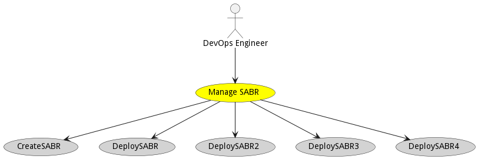
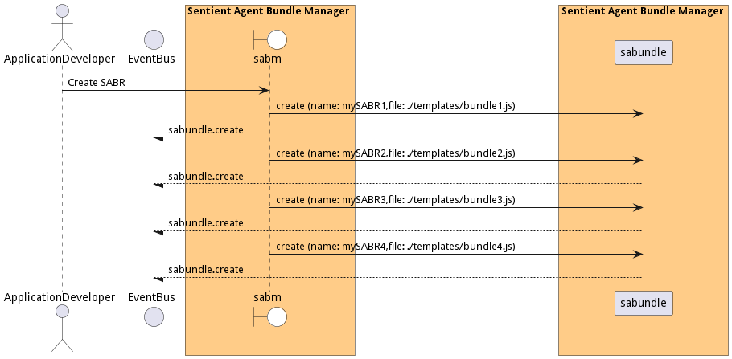
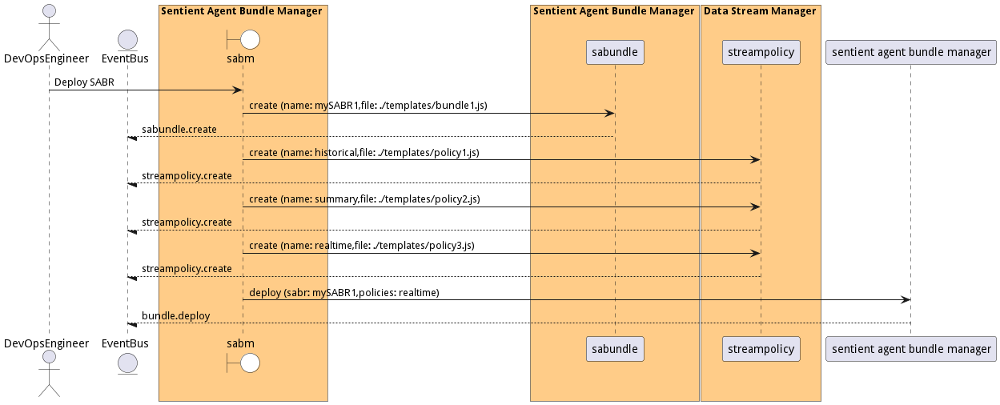
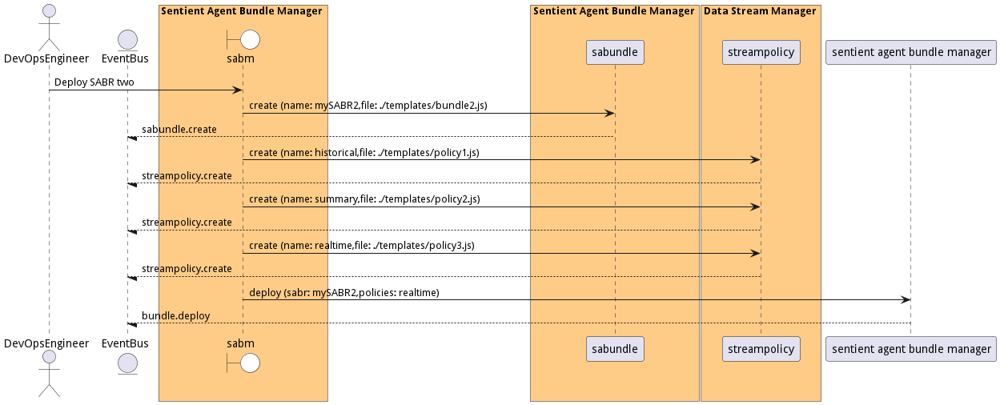

# Manage SABR

Manage SABR allows the devops engineers to create,deploy, updated and destroy SABRs in the system.

## Actors

* [DevOps Engineer](actor-devops)

## Detail Scenarios

* [CreateSABR](#scenario-CreateSABR)
* [DeploySABR](#scenario-DeploySABR)
* [DeploySABR2](#scenario-DeploySABR2)
* [DeploySABR3](#scenario-DeploySABR3)
* [DeploySABR4](#scenario-DeploySABR4)

### Scenario Create SABR

Create SABR in the system.

#### Steps

1. [sabundle create --name mySABR1 --file ./templates/bundle1.js](#action-sabundle create)

1. [sabundle create --name mySABR2 --file ./templates/bundle2.js](#action-sabundle create)

1. [sabundle create --name mySABR3 --file ./templates/bundle3.js](#action-sabundle create)

1. [sabundle create --name mySABR4 --file ./templates/bundle4.js](#action-sabundle create)

#### Actors

* [Application Developer](actor-applicationdeveloper)

### Scenario Deploy SABR

Deploy SABR in the system.

#### Steps

1. [sabundle create --name mySABR1 --file ./templates/bundle1.js](#action-sabundle create)

1. [streampolicy create --name historical --file ./templates/policy1.js](#action-streampolicy create)

1. [streampolicy create --name summary --file ./templates/policy2.js](#action-streampolicy create)

1. [streampolicy create --name realtime --file ./templates/policy3.js](#action-streampolicy create)

1. [diml sabm/bundle deploy --sabr mySABR1 --policies realtime](#action-diml-sabm-bundle deploy)

#### Actors

* [DevOps Engineer](actor-devops)

### Scenario Deploy SABR two

Deploy SABR with policies.

#### Steps

1. [sabundle create --name mySABR2 --file ./templates/bundle2.js](#action-sabundle create)

1. [streampolicy create --name historical --file ./templates/policy1.js](#action-streampolicy create)

1. [streampolicy create --name summary --file ./templates/policy2.js](#action-streampolicy create)

1. [streampolicy create --name realtime --file ./templates/policy3.js](#action-streampolicy create)

1. [diml sabm/bundle deploy --sabr mySABR2 --policies realtime](#action-diml-sabm-bundle deploy)

#### Actors

* [DevOps Engineer](actor-devops)

### Scenario Deploy SABR three

Deploy SABR with multiple policies and complex SABR.

#### Steps

1. [sabundle create --name mySABR3 --file ./templates/bundle3.js](#action-sabundle create)

1. [streampolicy create --name historical --file ./templates/policy1.js](#action-streampolicy create)

1. [streampolicy create --name summary --file ./templates/policy2.js](#action-streampolicy create)

1. [streampolicy create --name realtime --file ./templates/policy3.js](#action-streampolicy create)

1. [diml sabm/bundle deploy --sabr mySABR3 --policies realtime](#action-diml-sabm-bundle deploy)

#### Actors

* [DevOps Engineer](actor-devops)

### Scenario Deploy SABR four

Deploy SABR with three policies and complex transformations.

#### Steps

1. [sabundle create --name mySABR3 --file ./templates/bundle3.js](#action-sabundle create)

1. [streampolicy create --name historical --file ./templates/policy1.js](#action-streampolicy create)

1. [streampolicy create --name summary --file ./templates/policy2.js](#action-streampolicy create)

1. [streampolicy create --name realtime --file ./templates/policy3.js](#action-streampolicy create)

1. [diml sabm/bundle deploy --sabr mySABR3 --policies realtime](#action-diml-sabm-bundle deploy)

#### Actors

* [DevOps Engineer](actor-devops)

