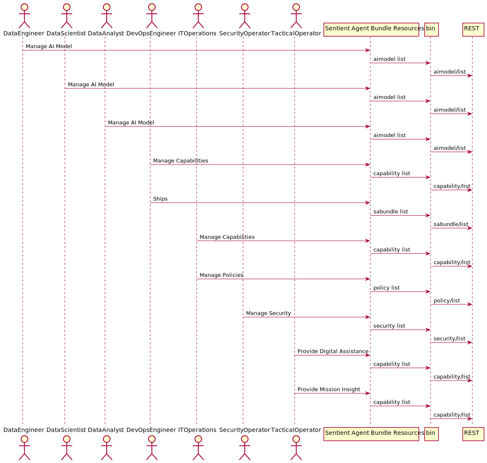
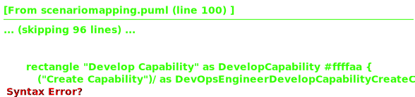

# Sentient Agent Bundle Resources

SABR is a system architecture that enables data transformation through deployment and managment AI algorightms in the data center, cloud and at the semi-connected edge.

# Concepts
## Data Stream Concept
* The combination of the producer, the topic and the consumers comprises a Data Stream.
* Data transfer through Data Streams uses a publish and subscribe (PubSub) framework.
* A Data Stream is created when a producer (a service on a server) publishes data to a topic.
* One or more consumers subscribe to a topic and are notified when data is published.
* A consumer can also choose to only consume data when a specific event occurs in a Data Stream.
* If a DDG cannot radiate, a producer will cache the data and, when re-connected, publish data on the topic again.

## Sentient Agent Bundle
* Sentient Agent Bundle Resources (Agent Bundle) manage transformation algorithms, data stream definitions and 
interactions between systems.
* The container ecosystem (including Docker and Kubernetes) and DevOps environments (Red Hat OpenShift and Jenk ins),
build and distribute SABRs to Docker swarms and K8s clusters.
* The combination of all executables (applications and services), configuration files, stream definitions and data 
schemas, and transformation algorithms is called an Sentient Agent Bundle Definition (SABD).
* An SABD is represented as one container image in the Docker and K8s ecosystem and is deployed to a processor to 
bring it into the Learning Corpus mesh architecture.
* A security hash is added to the security keys in the Package and used to notarize the container image in a 
deployment repository.

## SABR Details
* The Stream Manager creates the channels for each stream and monitors the streams.
* An Learning Stream is created to connect to the learning corpus. Input and Output.
* For each stream definition there are channels created for each mode of operation.
** Example: Historical, Summary, Realtime
* Modes of operation are defined for all the applications and the stream manager handles which channels to use 
during different modes of operation.
* Streams are encrypted and decrypted using hashes in the security keys.

## SABR Deployment

A SABR container contains the stream definitions, security keys, application definitions, AI 
models and transformation algorithms. When it is deployed it explodes the configuration and deploys as many 
containers as needed to run the SABR and configures the data stream manager to handle the streams and channels based 
on the policies of the system. All communication to and from the application happens through the channels 
established in the stream manager.

## SABR Logical Architecture
The SABR is an instantiation of the Edgemere Architecture and maps directly on top of the Edgemere Architecture. Not 
all of the elements of Edgemere are required for the SABR architecture. Assumptions that a SDI and Physical layer 
are already established in the solution are made. The following diagram shows the subsystem specific to the SABR 
architecture.

* [Application Manager](package--sabr-aml-am) – Responsible for the management (development, test and deployment) of
  applications in the solution
* [Capability Manager](package--sabr-aml-cm) – Responsible for the deployment and management of capabilities in the 
  ecosystem, including the deployments of multiple SABRs.
* [Data Stream Manager](package--sabr-diml-dsm) – Responsible for the deploying, monitoring, and provisioning of data 
  streams in the ecosystem. 
* [Learning Corpus](package--sabr-aml-lc) – Responsible for the management of AI learning algorithms, their updates, 
and deployments.
* [Security Aspect](package--sabr-sa) – Gives a common security model across the subsystems of the solution.
* [Sentient Agent Bundle Manager](package--sabr-diml-sabm) – Gives the ability to bundle datastreams, ai algorithms and 
operating in a heterogeneous environment.
* [Service Orchestrator](package--sabr-sml-so) – Responsible for the deployment and managment of services in the 
ecosystem.

## Use Cases

The following are the use cases of the Sentient Agent Bundle Resources subsystem. Each use case has primary and secondary scenarios
that are elaborated in the use case descriptions.

* [Find Enemy Combatant](usecase-FindEnemyCombatant)
* [Manage AI Model](usecase-ManageAIModel)
* [Manage Capabilities](usecase-ManageCapabilities)
* [Manage Capbilities](usecase-ManageCapbilities)

## Users

The following are the actors of the Sentient Agent Bundle Resources subsystem. This can include people, other subsystems 
inside the solution and even external subsystems. 

* [TacticalOperator](actor-tacticaloperator)
* [AIDeveloper](actor-aideveloper)
* [SoftwareDeveloper](actor-softwaredeveloper)
* [DevOpsEngineer](actor-devopsengineer)

## Interface

The subsystem has a REST, CLI, WebSocket, and Web interface. Use Cases and Scenarios can use any or all
of the interfaces to perform the work that needs to be completed. The following  diagram shows how
users interact with the system.

* [ sabr aimodel list](#action--sabr-aimodel-list)
* [ sabr application list](#action--sabr-application-list)
* [ sabr capability list](#action--sabr-capability-list)
* [ sabr pulsar streams](#action--sabr-pulsar-streams)
* [ sabr pulsar topic](#action--sabr-pulsar-topic)
* [ sabr pulsar topics](#action--sabr-pulsar-topics)

## Logical Artifacts

The Data Model for the  Sentient Agent Bundle Resources subsystem shows how the different objects and classes of object interact
and their structure.

### Sub Packages

The Sentient Agent Bundle Resources subsystem has sub packages as well. These subsystems are logical components to better
organize the architecture and make it easier to analyze, understand, design, and implement.

* [Application Management Layer](package--sabr-aml)
* [Common Physical Layer](package--sabr-cpl)
* [Distributed Information Management Layer](package--sabr-diml)
* [Identity Aspect](package--sabr-ia)
* [Security Aspect](package--sabr-sa)
* [Service Management Layer](package--sabr-sml)
* [Software Defined Infrastructure](package--sabr-sdi)

### Classes

The following are the classes in the data model of the Sentient Agent Bundle Resources subsystem.

## Deployment Architecture

This subsystem is deployed using micro-services as shown in the diagram below. The 'micro' module is
used to implement the micro-services in the system. The subsystem also has an CLI, REST and Web Interface
exposed through a nodejs application. The nodejs application will interface with the micro-services and
can monitor and drive work-flows through the mesh of micro-services. The deployment of the subsystem is 
dependent on the environment it is deployed. This subsystem has the following environments:
* [local](environment--sabr-local)
* [dev](environment--sabr-dev)
* [test](environment--sabr-test)
* [prod](environment--sabr-prod)

## Physical Architecture

The Sentient Agent Bundle Resources subsystem is physically laid out on a hybrid cloud infrastructure. Each microservice belongs
to a secure micro-segmented network. All of the micro-services communicate to each other and the main app through a
REST interface. A Command Line Interface (CLI), REST or Web User interface for the app is how other subsystems or actors 
interact. Requests are forwarded to micro-services through the REST interface of each micro-service. The subsystem has
the a unique layout based on the environment the physical space. The following are the environments for this
subsystems.
* [local](environment--sabr-local)
* [dev](environment--sabr-dev)
* [test](environment--sabr-test)
* [prod](environment--sabr-prod)

## Micro-Services

These are the micro-services for the subsystem. The combination of the micro-services help implement
the subsystem's logic.

### local

Detail information for the [local environment](environment--sabr-local)
can be found [here](environment--sabr-local)

Services in the local environment

* admin : sabr_admin
* am : am
* cm : cm
* dsm : dsm
* sa : sa
* lc : lc
* sabm : sabm
* so : so
* doc : sabr_doc

### dev

Detail information for the [dev environment](environment--sabr-dev)
can be found [here](environment--sabr-dev)

Services in the dev environment

* admin : sabr_admin
* am : am
* cm : cm
* dsm : dsm
* sa : sa
* lc : lc
* sabm : sabm
* so : so
* doc : sabr_doc

### test

Detail information for the [test environment](environment--sabr-test)
can be found [here](environment--sabr-test)

Services in the test environment

* admin : sabr_admin
* am : am
* cm : cm
* dsm : dsm
* sa : sa
* lc : lc
* sabm : sabm
* so : so
* doc : sabr_doc

### prod

Detail information for the [prod environment](environment--sabr-prod)
can be found [here](environment--sabr-prod)

Services in the prod environment

* admin : sabr_admin
* am : am
* cm : cm
* dsm : dsm
* sa : sa
* lc : lc
* sabm : sabm
* so : so
* doc : sabr_doc

## Activities and Flows
The Sentient Agent Bundle Resources subsystem provides the following activities and flows that help satisfy the use
cases and scenarios of the subsystem.

### Messages Sent

TBD

## Interface Details
The Sentient Agent Bundle Resources subsystem has a well defined interface. This interface can be accessed using a
command line interface (CLI), REST interface, and Web user interface. This interface is how all other
subsystems and actors can access the system.

### Action  sabr aimodel list

* REST - /sabr/aimodel/list
* bin -  sabr aimodel list
* js - .sabr.aimodel.list

Description of the action

| Name | Type | Required | Description |
|---|---|---|---|
| attr1 | string |false | Description for the parameter |

### Action  sabr application list

* REST - /sabr/application/list
* bin -  sabr application list
* js - .sabr.application.list

Description of the action

| Name | Type | Required | Description |
|---|---|---|---|
| attr1 | string |false | Description for the parameter |

### Action  sabr capability list

* REST - /sabr/capability/list
* bin -  sabr capability list
* js - .sabr.capability.list

Return the topics in the pulsar configuration

| Name | Type | Required | Description |
|---|---|---|---|
| id | string |true | ID of the topic. should be fully qualified |

### Action  sabr pulsar streams

* REST - /sabr/pulsar/streams
* bin -  sabr pulsar streams
* js - .sabr.pulsar.streams

Return the topics in the pulsar configuration

| Name | Type | Required | Description |
|---|---|---|---|
| id | string |true | ID of the topic. should be fully qualified |

### Action  sabr pulsar topic

* REST - /sabr/pulsar/topic
* bin -  sabr pulsar topic
* js - .sabr.pulsar.topic

Return the topics in the pulsar configuration

| Name | Type | Required | Description |
|---|---|---|---|
| id | string |true | ID of the topic. should be fully qualified |

### Action  sabr pulsar topics

* REST - /sabr/pulsar/topics
* bin -  sabr pulsar topics
* js - .sabr.pulsar.topics

Return the topics in the pulsar configuration

| Name | Type | Required | Description |
|---|---|---|---|

