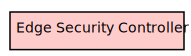
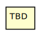
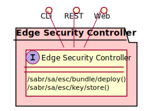

# Edge Security Controller

Edge Security Controller runs on every devices in the sabr ecosystem. It is responsible for decrypting SABs and deploying SABRs in the data mesh.

## Use Cases

The following are the use cases of the Edge Security Controller subsystem. Each use case has primary and secondary scenarios
that are elaborated in the use case descriptions.

## Users

The following are the actors of the Edge Security Controller subsystem. This can include people, other subsystems
inside the solution and even external subsystems.

## Interface

The subsystem has a REST, CLI, WebSocket, and Web interface. Use Cases and Scenarios can use any or all
of the interfaces to perform the work that needs to be completed. The following  diagram shows how
users interact with the system.

* [ sabr sa esc bundle deploy](#action--sabr-sa-esc-bundle-deploy)
* [ sabr sa esc key store](#action--sabr-sa-esc-key-store)

## Logical Artifacts

The Data Model for the  Edge Security Controller subsystem shows how the different objects and classes of object interact
and their structure.

### Sub Packages

The Edge Security Controller subsystem has sub packages as well. These subsystems are logical components to better
organize the architecture and make it easier to analyze, understand, design, and implement.

### Classes

The following are the classes in the data model of the Edge Security Controller subsystem.

## Deployment Architecture

This subsystem is deployed using micro-services as shown in the diagram below. The 'micro' module is
used to implement the micro-services in the system. The subsystem also has an CLI, REST and Web Interface
exposed through a nodejs application. The nodejs application will interface with the micro-services and
can monitor and drive work-flows through the mesh of micro-services. The deployment of the subsystem is
dependent on the environment it is deployed. This subsystem has the following environments:
* [local](environment--sabr-sa-esc-local)
* [dev](environment--sabr-sa-esc-dev)
* [test](environment--sabr-sa-esc-test)
* [prod](environment--sabr-sa-esc-prod)

## Physical Architecture

The Edge Security Controller subsystem is physically laid out on a hybrid cloud infrastructure. Each microservice belongs
to a secure micro-segmented network. All of the micro-services communicate to each other and the main app through a
REST interface. A Command Line Interface (CLI), REST or Web User interface for the app is how other subsystems or actors
interact. Requests are forwarded to micro-services through the REST interface of each micro-service. The subsystem has
the a unique layout based on the environment the physical space. The following are the environments for this
subsystems.
* [local](environment--sabr-sa-esc-local)
* [dev](environment--sabr-sa-esc-dev)
* [test](environment--sabr-sa-esc-test)
* [prod](environment--sabr-sa-esc-prod)

## Micro-Services

These are the micro-services for the subsystem. The combination of the micro-services help implement
the subsystem's logic.

### local

Detail information for the [local environment](environment--sabr-sa-esc-local)
can be found [here](environment--sabr-sa-esc-local)

Services in the local environment

### dev

Detail information for the [dev environment](environment--sabr-sa-esc-dev)
can be found [here](environment--sabr-sa-esc-dev)

Services in the dev environment

### test

Detail information for the [test environment](environment--sabr-sa-esc-test)
can be found [here](environment--sabr-sa-esc-test)

Services in the test environment

### prod

Detail information for the [prod environment](environment--sabr-sa-esc-prod)
can be found [here](environment--sabr-sa-esc-prod)

Services in the prod environment

## Activities and Flows
The Edge Security Controller subsystem provides the following activities and flows that help satisfy the use
cases and scenarios of the subsystem.

### Messages Sent

| Event | Description | Emitter |
|-------|-------------|---------|

## Interface Details
The Edge Security Controller subsystem has a well defined interface. This interface can be accessed using a
command line interface (CLI), REST interface, and Web user interface. This interface is how all other
subsystems and actors can access the system.

### Action  sabr sa esc bundle deploy

* REST - /sabr/sa/esc/bundle/deploy?name=string&amp;version=string&amp;target=string
* bin -  sabr sa esc bundle deploy --name string --version string --target string
* js - .sabr.sa.esc.bundle.deploy({ name:string,version:string,target:string })

#### Description
Deploy a SAB bundle that is passed in.

#### Parameters

| Name | Type | Required | Description |
|---|---|---|---|
| name | string |true | Name of the bundle to deploy |
| version | string |true | Version of the bundle |
| target | string |true | Target Devices to deploy the bundle. |

### Action  sabr sa esc key store

* REST - /sabr/sa/esc/key/store?target=string&amp;bundle=string&amp;version=true&amp;key=string&amp;iv=string
* bin -  sabr sa esc key store --target string --bundle string --version true --key string --iv string
* js - .sabr.sa.esc.key.store({ target:string,bundle:string,version:true,key:string,iv:string })

#### Description
Store a Key for the bundle decryption

#### Parameters

| Name | Type | Required | Description |
|---|---|---|---|
| target | string |true | Directory to perform the build. |
| bundle | string |false | Recursive build from the directory down. |
| version | true | | Version of the bundle encrypted. |
| key | string |true | Key to be used for the unbundling of the SAB build. |
| iv | string |true | IV of the Key for the decryption. |

