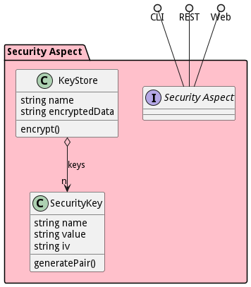

# Security Aspect

SecurityAspect is a package that contains all security tools and frameworks for the system.

## Use Cases

The following are the use cases of the Security Aspect subsystem. Each use case has primary and secondary scenarios
that are elaborated in the use case descriptions.

## Users

The following are the actors of the Security Aspect subsystem. This can include people, other subsystems
inside the solution and even external subsystems.

## Interface

The subsystem has a REST, CLI, WebSocket, and Web interface. Use Cases and Scenarios can use any or all
of the interfaces to perform the work that needs to be completed. The following  diagram shows how
users interact with the system.

* [ sabr sa securitymanager authenticate](#action--sabr-sa-securitymanager-authenticate)
* [ sabr sa securitymanager generatestreamkeys](#action--sabr-sa-securitymanager-generatestreamkeys)
* [ sabr sa securitymanager getbootstrapkey](#action--sabr-sa-securitymanager-getbootstrapkey)
* [ sabr sa securitymanager getregistrationcreds](#action--sabr-sa-securitymanager-getregistrationcreds)
* [ sabr sa securitymanager getstreamkeys](#action--sabr-sa-securitymanager-getstreamkeys)
* [ sabr sa securitymanager provisionentity](#action--sabr-sa-securitymanager-provisionentity)
* [ sabr sa securitymanager registerentity](#action--sabr-sa-securitymanager-registerentity)
* [ sabr sa securitymanager requestkeys](#action--sabr-sa-securitymanager-requestkeys)
* [ sabr sa securitymanager validate](#action--sabr-sa-securitymanager-validate)

## Logical Artifacts

The Data Model for the  Security Aspect subsystem shows how the different objects and classes of object interact
and their structure.

### Sub Packages

The Security Aspect subsystem has sub packages as well. These subsystems are logical components to better
organize the architecture and make it easier to analyze, understand, design, and implement.

* [Edge Security Controller](package--sabr-sa-esc)
* [Key Manager](package--sabr-sa-km)

### Classes

The following are the classes in the data model of the Security Aspect subsystem.

* [Credential](class-Credential)
* [EncryptedVault](class-EncryptedVault)
* [JWT](class-JWT)
* [KeyStore](class-KeyStore)
* [SecureVault](class-SecureVault)
* [SecurityKey](class-SecurityKey)
* [Seed](class-Seed)
* [WorkingEnclave](class-WorkingEnclave)

## Deployment Architecture

This subsystem is deployed using micro-services as shown in the diagram below. The 'micro' module is
used to implement the micro-services in the system. The subsystem also has an CLI, REST and Web Interface
exposed through a nodejs application. The nodejs application will interface with the micro-services and
can monitor and drive work-flows through the mesh of micro-services. The deployment of the subsystem is
dependent on the environment it is deployed. This subsystem has the following environments:
* [dev](environment--sabr-sa-dev)
* [test](environment--sabr-sa-test)
* [prod](environment--sabr-sa-prod)

## Physical Architecture

The Security Aspect subsystem is physically laid out on a hybrid cloud infrastructure. Each microservice belongs
to a secure micro-segmented network. All of the micro-services communicate to each other and the main app through a
REST interface. A Command Line Interface (CLI), REST or Web User interface for the app is how other subsystems or actors
interact. Requests are forwarded to micro-services through the REST interface of each micro-service. The subsystem has
the a unique layout based on the environment the physical space. The following are the environments for this
subsystems.
* [dev](environment--sabr-sa-dev)
* [test](environment--sabr-sa-test)
* [prod](environment--sabr-sa-prod)

## Micro-Services

These are the micro-services for the subsystem. The combination of the micro-services help implement
the subsystem's logic.

### dev

Detail information for the [dev environment](environment--sabr-sa-dev)
can be found [here](environment--sabr-sa-dev)

Services in the dev environment

* sabr_sa_web : sabr_sa_web

### test

Detail information for the [test environment](environment--sabr-sa-test)
can be found [here](environment--sabr-sa-test)

Services in the test environment

* sabr_sa_web : sabr_sa_web

### prod

Detail information for the [prod environment](environment--sabr-sa-prod)
can be found [here](environment--sabr-sa-prod)

Services in the prod environment

* sabr_sa_web : sabr_sa_web

## Activities and Flows
The Security Aspect subsystem provides the following activities and flows that help satisfy the use
cases and scenarios of the subsystem.

### Messages Sent

| Event | Description | Emitter |
|-------|-------------|---------|
| credential.create |  When an object of type Credential is created. | Credential
| credential.destroy |  When an object of type Credential is destroyed. | Credential
| credential.updated |  When an object of type Credential has an attribute or association updated. | Credential
| encryptedvault.create |  When an object of type EncryptedVault is created. | EncryptedVault
| encryptedvault.destroy |  When an object of type EncryptedVault is destroyed. | EncryptedVault
| encryptedvault.updated |  When an object of type EncryptedVault has an attribute or association updated. | EncryptedVault
| jwt.create |  When an object of type JWT is created. | JWT
| jwt.destroy |  When an object of type JWT is destroyed. | JWT
| jwt.updated |  When an object of type JWT has an attribute or association updated. | JWT
| keystore.create |  When an object of type KeyStore is created. | KeyStore
| keystore.destroy |  When an object of type KeyStore is destroyed. | KeyStore
| keystore.updated |  When an object of type KeyStore has an attribute or association updated. | KeyStore
| securevault.create |  When an object of type SecureVault is created. | SecureVault
| securevault.destroy |  When an object of type SecureVault is destroyed. | SecureVault
| securevault.updated |  When an object of type SecureVault has an attribute or association updated. | SecureVault
| securitykey.create |  When an object of type SecurityKey is created. | SecurityKey
| securitykey.destroy |  When an object of type SecurityKey is destroyed. | SecurityKey
| securitykey.updated |  When an object of type SecurityKey has an attribute or association updated. | SecurityKey
| seed.create |  When an object of type Seed is created. | Seed
| seed.destroy |  When an object of type Seed is destroyed. | Seed
| seed.updated |  When an object of type Seed has an attribute or association updated. | Seed
| workingenclave.create |  When an object of type WorkingEnclave is created. | WorkingEnclave
| workingenclave.destroy |  When an object of type WorkingEnclave is destroyed. | WorkingEnclave
| workingenclave.updated |  When an object of type WorkingEnclave has an attribute or association updated. | WorkingEnclave

## Interface Details
The Security Aspect subsystem has a well defined interface. This interface can be accessed using a
command line interface (CLI), REST interface, and Web user interface. This interface is how all other
subsystems and actors can access the system.

### Action  sabr sa securitymanager authenticate

* REST - /sabr/sa/securitymanager/authenticate?deviceUID=string
* bin -  sabr sa securitymanager authenticate --deviceUID string
* js - .sabr.sa.securitymanager.authenticate({ deviceUID:string })

#### Description
Provision a Security Entity

#### Parameters

| Name | Type | Required | Description |
|---|---|---|---|
| deviceUID | string |true | DeviceUID of the SABR that is being authenticated |

### Action  sabr sa securitymanager generatestreamkeys

* REST - /sabr/sa/securitymanager/generatestreamkeys?name=string
* bin -  sabr sa securitymanager generatestreamkeys --name string
* js - .sabr.sa.securitymanager.generatestreamkeys({ name:string })

#### Description
Generate the Data Stream Encryption Keys

#### Parameters

| Name | Type | Required | Description |
|---|---|---|---|
| name | string |true | Name of the Data Stream |

### Action  sabr sa securitymanager getbootstrapkey

* REST - /sabr/sa/securitymanager/getbootstrapkey?name=string
* bin -  sabr sa securitymanager getbootstrapkey --name string
* js - .sabr.sa.securitymanager.getbootstrapkey({ name:string })

#### Description
Deploy a SAB bundle that is passed in.

#### Parameters

| Name | Type | Required | Description |
|---|---|---|---|
| name | string |true | Name of the SABR to get Registration Creds |

### Action  sabr sa securitymanager getregistrationcreds

* REST - /sabr/sa/securitymanager/getregistrationcreds?name=string
* bin -  sabr sa securitymanager getregistrationcreds --name string
* js - .sabr.sa.securitymanager.getregistrationcreds({ name:string })

#### Description
Deploy a SAB bundle that is passed in.

#### Parameters

| Name | Type | Required | Description |
|---|---|---|---|
| name | string |true | Name of the SABR to get Registration Creds |

### Action  sabr sa securitymanager getstreamkeys

* REST - /sabr/sa/securitymanager/getstreamkeys?name=string
* bin -  sabr sa securitymanager getstreamkeys --name string
* js - .sabr.sa.securitymanager.getstreamkeys({ name:string })

#### Description
Get the Data Stream Encryption Keys

#### Parameters

| Name | Type | Required | Description |
|---|---|---|---|
| name | string |true | Name of the Data Stream |

### Action  sabr sa securitymanager provisionentity

* REST - /sabr/sa/securitymanager/provisionentity?name=string&amp;uauth=string
* bin -  sabr sa securitymanager provisionentity --name string --uauth string
* js - .sabr.sa.securitymanager.provisionentity({ name:string,uauth:string })

#### Description
Provision a Security Entity

#### Parameters

| Name | Type | Required | Description |
|---|---|---|---|
| name | string |true | Name of the SABR to register to start receiving security keys |
| uauth | string |true | Unique Authentication Key of the Entity |

### Action  sabr sa securitymanager registerentity

* REST - /sabr/sa/securitymanager/registerentity?name=string
* bin -  sabr sa securitymanager registerentity --name string
* js - .sabr.sa.securitymanager.registerentity({ name:string })

#### Description
Register a Security Entity

#### Parameters

| Name | Type | Required | Description |
|---|---|---|---|
| name | string |true | Name of the SABR to register to start receiving security keys |

### Action  sabr sa securitymanager requestkeys

* REST - /sabr/sa/securitymanager/requestkeys?JWT=json&amp;streamID=string&amp;timeRange=string
* bin -  sabr sa securitymanager requestkeys --JWT json --streamID string --timeRange string
* js - .sabr.sa.securitymanager.requestkeys({ JWT:json,streamID:string,timeRange:string })

#### Description
Provision a Security Entity

#### Parameters

| Name | Type | Required | Description |
|---|---|---|---|
| JWT | json |true | JWT for the entity that is requesting a group of rotating keys |
| streamID | string |true | DataStream id to retrieve the keys |
| timeRange | string |true | Range of time to retrieve the keys via the secure channel |

### Action  sabr sa securitymanager validate

* REST - /sabr/sa/securitymanager/validate?JWT=json
* bin -  sabr sa securitymanager validate --JWT json
* js - .sabr.sa.securitymanager.validate({ JWT:json })

#### Description
Provision a Security Entity

#### Parameters

| Name | Type | Required | Description |
|---|---|---|---|
| JWT | json |true | Validate the JWT |

