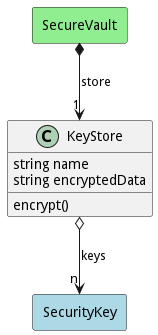

# KeyStore

KeyStore contains security and other secret keys

## Attributes

* name:string - Name of the Key Store
* encryptedData:string - This is the encrypted representation of the key store.

## Associations

| Name | Cardinality | Class | Composition | Owner | Description |
| --- | --- | --- | --- | --- | --- |
| keys | n | SecurityKey | false | false |  |

## Methods
* [encrypt() - Encrypt a the Security Vault](#action-encrypt)

<h2>Method Details</h2>
    
### Action keystore encrypt

* REST - keystore/encrypt?key=SecurityKey&amp;iv=SecurityKey
* bin - keystore encrypt --key SecurityKey --iv SecurityKey
* js - keystore.encrypt({ key:SecurityKey,iv:SecurityKey })

#### Description
Encrypt a the Security Vault

#### Parameters

| Name | Type | Required | Description |
|---|---|---|---|
| key | SecurityKey |true | The encryption key for the store. |
| iv | SecurityKey |true | The encryption key for the store. |

