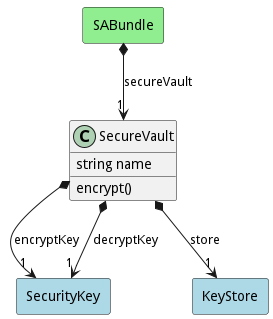

# SecureVault

The secure vault contains a SecureKey with the decryption keys to the encrypted keystore

## Attributes

* name:string - Name of the securevalut

## Associations

| Name | Cardinality | Class | Composition | Owner | Description |
| --- | --- | --- | --- | --- | --- |
| seed | 1 | Seed | true | true |  |
| enclave | 1 | WorkingEnclave | false | true |  |
| vault | 1 | EncryptedVault | true | true |  |

## Users of the Model

| Name | Cardinality | Class | Composition | Owner | Description |
| --- | --- | --- | --- | --- | --- |
| secureVault | 1 | SABundle | true | true |  |

## Methods
* [encrypt() - Encrypt a the Security Vault](#action-encrypt)

<h2>Method Details</h2>
    
### Action securevault encrypt

* REST - securevault/encrypt?name=string
* bin - securevault encrypt --name string
* js - securevault.encrypt({ name:string })

#### Description
Encrypt a the Security Vault

#### Parameters

| Name | Type | Required | Description |
|---|---|---|---|
| name | string |false | Name of the SecurityKey Pair |

