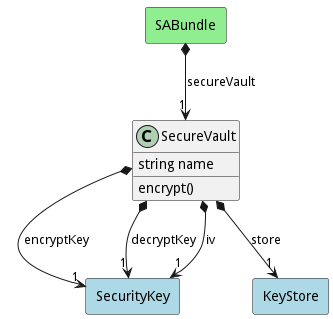

# SecureVault

The secure vault contains a SecureKey with the decryption keys to the encrypted keystore

## Attributes

* name:string - Name of the securevalut

## Associations

| Name | Cardinality | Class | Composition | Owner | Description |
| --- | --- | --- | --- | --- | --- |
| encryptKey | 1 | SecurityKey | true | true |  |
| decryptKey | 1 | SecurityKey | true | true |  |
| store | 1 | KeyStore | true | true |  |

## Users of the Model

| Name | Cardinality | Class | Composition | Owner | Description |
| --- | --- | --- | --- | --- | --- |
| secureVault | 1 | SABundle | true | true |  |

## Methods

* [encrypt() - Encrypt a the Security Vault](#action-encrypt)

<h2>Method Details</h2>
    
### Action securevault encrypt

* REST - securevault/encrypt?
* bin - securevault encrypt 
* js - securevault.encrypt({  })

#### Description
Encrypt a the Security Vault

#### Parameters

No parameters

