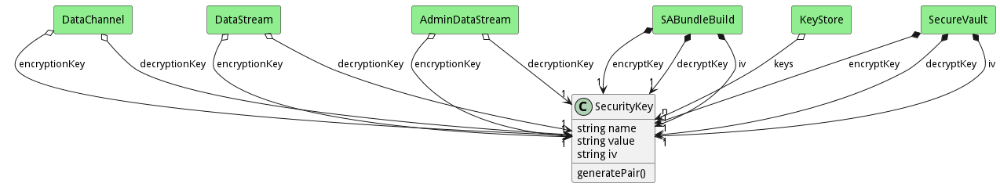

# SecurityKey

Security Key

## Attributes

* name:string - Name of the security key
* value:string - Value of the security key.

## Associations

No associations

## Users of the Model

| Name | Cardinality | Class | Composition | Owner | Description |
| --- | --- | --- | --- | --- | --- |
| encryptionKey | 1 | DataStream |  |  | This is the encryption key for the data stream |
| decryptionKey | 1 | DataStream |  |  | This is the decryption key for the data stream |
| keys | n | KeyStore | false | false |  |
| encryptKey | 1 | SecureVault | true | true |  |
| decryptKey | 1 | SecureVault | true | true |  |

## Methods

<h2>Method Details</h2>
    

