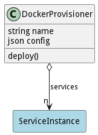

# DockerProvisioner

The DockerProvisioner uses Docker to provision services in the system. This is a specialization in the system so different provisioners can be used. In this case the docker swarm engine is used to provision services.

## Attributes

* name:string - Name of the docker provisioner
* config:json - Configuration for the provisioner.

## Associations

| Name | Cardinality | Class | Composition | Owner | Description |
| --- | --- | --- | --- | --- | --- |
| services | n | ServiceInstance | false | false |  |

## Users of the Model

| Name | Cardinality | Class | Composition | Owner | Description |
| --- | --- | --- | --- | --- | --- |

## Methods

* [deploy() - Deploy a Service using docker](#action-deploy)

<h2>Method Details</h2>
    
### Action dockerprovisioner deploy

* REST - dockerprovisioner/deploy?services=ref
* bin - dockerprovisioner deploy --services ref
* js - dockerprovisioner.deploy({ services:ref })

#### Description
Deploy a Service using docker

#### Parameters
| Name | Type | Required | Description |
|---|---|---|---|
| services | ref |true | Service to deploy |

