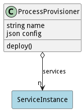

# ProcessProvisioner

Provisions services as spawned processes. This is a specailization of the Provisioner abstract class. It focuses on running a service on the same machine as the provisioner using a spawned process.

## Attributes

* name:string - Name of the provisioner
* config:json - Configuration for the provisioner.

## Associations

| Name | Cardinality | Class | Composition | Owner | Description |
| --- | --- | --- | --- | --- | --- |
| services | n | ServiceInstance | false | false |  |

## Methods
* [deploy() - Deploy a Service generically.](#action-deploy)

<h2>Method Details</h2>
    
### Action processprovisioner deploy

* REST - processprovisioner/deploy?services=ref
* bin - processprovisioner deploy --services ref
* js - processprovisioner.deploy({ services:ref })

#### Description
Deploy a Service generically.

#### Parameters

| Name | Type | Required | Description |
|---|---|---|---|
| services | ref |true | Service to deploy |

