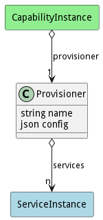

# Provisioner

Abstract Provisioner Class used to develop an interface for the different provisioners.

## Attributes

* name:string - Name of the provisioner
* config:json - Configuration for the provisioner.

## Associations

| Name | Cardinality | Class | Composition | Owner | Description |
| --- | --- | --- | --- | --- | --- |
| services | n | ServiceInstance | false | false |  |

## Methods

<h2>Method Details</h2>
    

