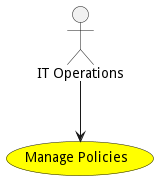

# Manage Policies

Manage Policies use case includes establishing and managing DDIL environment policies for the complete ecosystem, individual capabilities, SABRs, and applications. This use case also refers to orchestration and deployment policies.

## Actors

* [IT Operations](actor-itops)

## Detail Scenarios

* [ActivatePolicy](#scenario-ActivatePolicy)
* [CreateChannelActivationPolicy](#scenario-CreateChannelActivationPolicy)
* [CreateChannelCreationPolicy](#scenario-CreateChannelCreationPolicy)
* [CreatePolicy](#scenario-CreatePolicy)
* [DeactivatePolicy](#scenario-DeactivatePolicy)
* [UpdateChannelPolicy](#scenario-UpdateChannelPolicy)

### Scenario ActivatePolicy

Activate Channel Policy in the SABR. Evaluation of the policies and consistency of the policies is critical to make sure that channel activation does not impact other policies adversely

#### Steps
1. [streampolicy activate --name policy1](#action-streampolicy activate)

#### Actors

* [DataEngineer](actor-dataengineer)

### Scenario Create Channel Activation Policy

Create policies for the system which include ChannelActivationPolicies

#### Steps
1. [streampolicy create --name policy1 --file ./templates/policy1.js](#action-streampolicy create)
1. [streampolicy create --name policy2 --file ./templates/policy2.js](#action-streampolicy create)

#### Actors

* [DataEngineer](actor-dataengineer)

### Scenario Create Channel Creation Policy

Create policies for the system which include ChannelCreationPolicies

#### Steps
1. [streampolicy create --name policy1 --file ./templates/policy1.js](#action-streampolicy create)
1. [streampolicy create --name policy2 --file ./templates/policy2.js](#action-streampolicy create)

#### Actors

* [DataEngineer](actor-dataengineer)

### Scenario Create Policy

Create policies for the system which include ChannelCreationPolicies and ChannelActivationPolicies

#### Steps
1. [streampolicy create --name policy1 --file ./templates/policy1.js](#action-streampolicy create)
1. [streampolicy create --name policy2 --file ./templates/policy2.js](#action-streampolicy create)

#### Actors

* [DataEngineer](actor-dataengineer)

### Scenario Deactivate Policy

Deactivate Policy in a SABR. The deactivation of the policy should be propigated to all SABRS within the scopr of the policy.

#### Steps
1. [streampolicy create --name policy1 --file ./templates/policy1.js](#action-streampolicy create)
1. [streampolicy activate` --name policy2](#action-streampolicy activate`)
1. [streampolicy deactivate` --name policy2](#action-streampolicy deactivate`)

#### Actors

* [DataEngineer](actor-dataengineer)

### Scenario Update Channel Policy

Update Channel Policies. This can include the creation and activation channels. If a channel is destroyed in the update then all of the data cached in the channel should be destroyed.

#### Steps
1. [streampolicy update --name policy1 --file ./templates/policy1.js](#action-streampolicy update)
1. [streampolicy update --name policy2 --file ./templates/policy2.js](#action-streampolicy update)

#### Actors

* [DataEngineer](actor-dataengineer)

