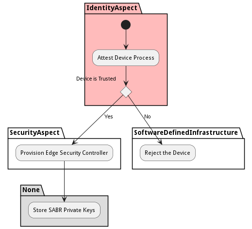

# Device Provision Process

Devices are Provisioned in the ecosystem which includes attestation and storage of private keys so the device can decrypt SAB Builds that are provisioned to the devices

## Activities

* Init - Initial state for the workflow
* Attest Device Process - Attest the device to the SABR ecosystem. Make sure the device is trusted and in a good well known state.
* Reject the Device - The device is not trusted and rejected from the SABR Ecosystem.
* Provision Edge Security Controller - Provision the Edge Security Controller to the device when the device is attested to the SABR ecosystem.
* Store SABR Private Keys - Store the SABR private Keys in a protected area of the Device. These private keys are used to decrypt the SAB Build bundles so SABRs can be deployed.
