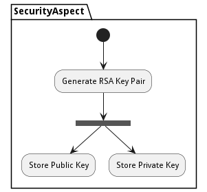

# Security Key Generation Process

Generate Security Key generation pairs and store the public key in the security store and distribute them to all of the targeted devices. The private key is stored in a secure vault as well.

## Activities

* Init - Initial state for the workflow
* Generate RSA Key Pair - Generate a RSA Key Pair based on a random number generated.
* Store Public Key - Store the Public Key to be distributed later for SAB Build.
* Store Private Key - Store the Private Key to be distributed later for Device Controllers.
